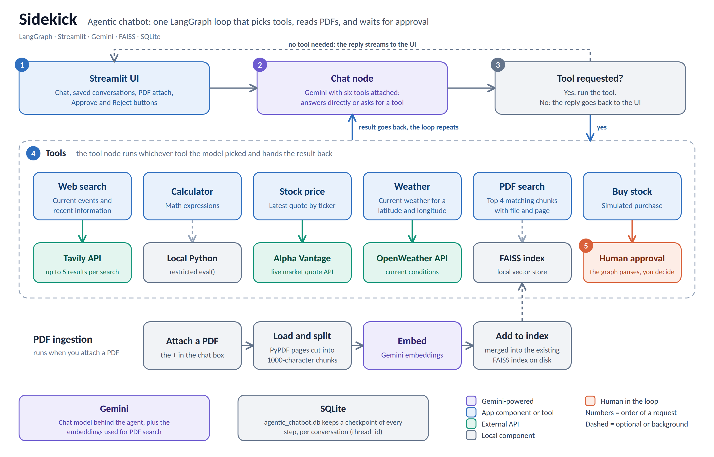

# 🤖 Sidekick — An Agentic Chatbot with LangGraph

An AI chat assistant that decides for itself which tool to use. It can search the web, do math, look up stock prices and weather, answer questions from PDFs you upload, and pause to ask for your approval before a (simulated) stock purchase.


## Why this project?

Most chatbots only generate text. Sidekick is built as an agent loop in LangGraph: the model reads your message, calls a tool when it needs one, reads the result, and keeps going until it can answer. Anything with side effects goes through a human approval step, so the model never acts on its own.

## Features

- 🧰 Tool-calling agent on Gemini that chooses between answering directly and using one of six tools
- 🔎 Web search for current events and recent information via Tavily
- 📄 Chat with your PDFs: attach files in the chat box and ask questions, answered from the most relevant chunks with file and page info (RAG with FAISS and Gemini embeddings)
- 📈 Stock price lookup via Alpha Vantage
- ⛅ Current weather for any coordinates via OpenWeather
- 🧮 Calculator for math expressions
- 🙋 Human-in-the-loop approval: simulated stock purchases pause the graph and wait for you to click Approve or Reject
- 💬 Multiple conversations with a sidebar, saved in SQLite so you can reopen any of them later
- ⚡ Streaming responses with a live status box showing which tool is running
- 🐳 Docker support, deployed on Render

## Architecture



Every message goes to a chat node, which is Gemini with six tools attached. If the model asks for a tool, the tool node runs it and the result goes back to the chat node, and this repeats until the model answers without needing a tool. The final answer streams to the Streamlit UI. Attached PDFs are split into chunks, embedded, and added to a local FAISS index that the PDF search tool reads from. The buy-stock tool calls LangGraph's `interrupt()`, which pauses the graph until you approve or reject in the UI. Every step is checkpointed to SQLite per conversation.

## Tools

| Tool | What it does | Backed by |
| --- | --- | --- |
| Web search | Current events and recent information, up to 5 results | Tavily API |
| Calculator | Math expressions, including `math.sqrt` and similar | Local Python |
| Stock price | Latest quote for a ticker symbol | Alpha Vantage API |
| Weather | Current weather for a latitude and longitude | OpenWeather API |
| PDF search | Top 4 matching chunks from uploaded PDFs, with source file and page | FAISS + Gemini embeddings |
| Buy stock | Simulated purchase that needs your approval first | LangGraph `interrupt()` |

## Tech Stack

- Python 3.14+
- Streamlit
- LangGraph
- LangChain
- Gemini (chat model and embeddings) via `langchain-google-genai`
- FAISS (`faiss-cpu`) and PyPDF for PDF retrieval
- SQLite checkpointing via `langgraph-checkpoint-sqlite`
- Tavily, Alpha Vantage, and OpenWeather APIs
- Docker and Render (deployment)
- uv

## Project Structure

```text
.
├── app.py                     # Streamlit UI: chat, sidebar, PDF upload, approval buttons
├── agentic_chatbot.py         # LangGraph agent: tools, RAG pipeline, SQLite checkpointing
├── sidekick_architecture.png  # Architecture diagram
├── requirements.txt
├── pyproject.toml
├── uv.lock
├── Dockerfile
├── .dockerignore
├── .env.example
├── LICENSE
└── README.md
```

Three things are created at runtime and are gitignored: `agentic_chatbot.db` (conversation checkpoints), `faiss_db/` (the PDF vector index), and `uploaded_docs/` (the PDFs you attach).

## Prerequisites

Before running the project locally, make sure you have:

- Python 3.14 or newer installed
- API keys for:
  - Gemini
  - Tavily
  - OpenWeather
  - Alpha Vantage

## Environment Variables

Create a `.env` file in the project root with the following variables (see `.env.example`):

```env
GEMINI_API_KEY=your_gemini_api_key
TAVILY_API_KEY=your_tavily_api_key
OPENWEATHER_API_KEY=your_openweather_api_key
ALPHAVANTAGE_API_KEY=your_alphavantage_api_key
```

## Installation

```bash
uv venv
source .venv/bin/activate       # macOS/Linux
.venv\Scripts\Activate.ps1      # Windows PowerShell
uv pip install -r requirements.txt
```

Since the project includes a `uv.lock`, `uv sync` also works.

## Running the App

```bash
streamlit run app.py
```

Then open your browser at:

```text
http://localhost:8501
```

## Things to Try

- `What's the latest news about SpaceX?` uses web search
- `What is sqrt(144) * 12?` uses the calculator
- `What's the current price of AAPL?` uses the stock tool
- `What's the weather at latitude 35.68, longitude 139.69?` uses the weather tool
- Attach a PDF with the `+` in the chat box, then ask `Summarize the uploaded document`
- `Buy 10 shares of TSLA` pauses and shows Approve and Reject buttons

## Running with Docker

```bash
docker build -t sidekick .
docker run -p 8501:8501 --env-file .env sidekick
```

Then open `http://localhost:8501`.

## Deployment

Sidekick is deployed on [Render](https://render.com) as a Docker-based web service.

1. Push this repo to GitHub.
2. On Render, create a new **Web Service** and connect the repo. Render detects and builds the included `Dockerfile` automatically.
3. Add the four environment variables listed above under the service's **Environment** tab. The `.dockerignore` keeps your local `.env` out of the image, so Render needs them set there.
4. The container runs Streamlit bound to `0.0.0.0` on port 8501, so it is reachable from outside the container.
5. Every push to the connected branch triggers an automatic redeploy.

> ⚠️ Render's filesystem is ephemeral unless you attach a persistent disk. Without one, conversation history, uploaded PDFs, and the FAISS index are reset whenever the service redeploys or restarts.

## How the Workflow Works

1. You send a message in the chat box, optionally with PDFs attached. Attached PDFs are saved, split into chunks, embedded with Gemini, and added to the FAISS index.
2. The chat node sends the conversation to Gemini, which has all six tools attached. It either answers directly or asks for a tool.
3. If a tool is requested, the tool node runs it and the result goes back to the chat node. This loop repeats until the model has what it needs.
4. The final answer streams into the chat, and a status box shows which tools were used along the way.
5. If the model calls the buy-stock tool, the graph pauses with `interrupt()`. The UI shows Approve and Reject buttons, and your choice resumes the graph with `Command(resume=...)`.
6. After every step, the conversation state is checkpointed in SQLite under its `thread_id`. The sidebar lists these threads, so any past conversation, including one waiting on an approval, can be reopened.

## Limitations

- Stock purchases are simulated. No brokerage is connected and no real orders are placed.
- The calculator evaluates expressions with a restricted `eval()`. It is fine for local use but is not hardened for untrusted input.
- There is a single FAISS index shared by all conversations, so a PDF uploaded in one chat is searchable from every other chat.
- The weather tool takes coordinates, so the model has to work out latitude and longitude from a place name.
- Stock and weather lookups depend on the rate limits of those providers' free plans.
- Chat history, the PDF index, and uploaded files are local files. In Docker, and on Render without a persistent disk, they live on the container's filesystem and are lost when it is rebuilt or restarted.
- The FAISS index is loaded with `allow_dangerous_deserialization` enabled, so only load indexes you created yourself.
- There are no user accounts. Anyone who can open the app sees the same list of conversations.


## License

This project is licensed under the Apache-2.0 license. See [LICENSE](LICENSE) for details.

## Acknowledgments

Built with LangGraph, LangChain, Streamlit, and Gemini, and intended as a practical example of a tool-using agent with retrieval and a human-in-the-loop approval step.